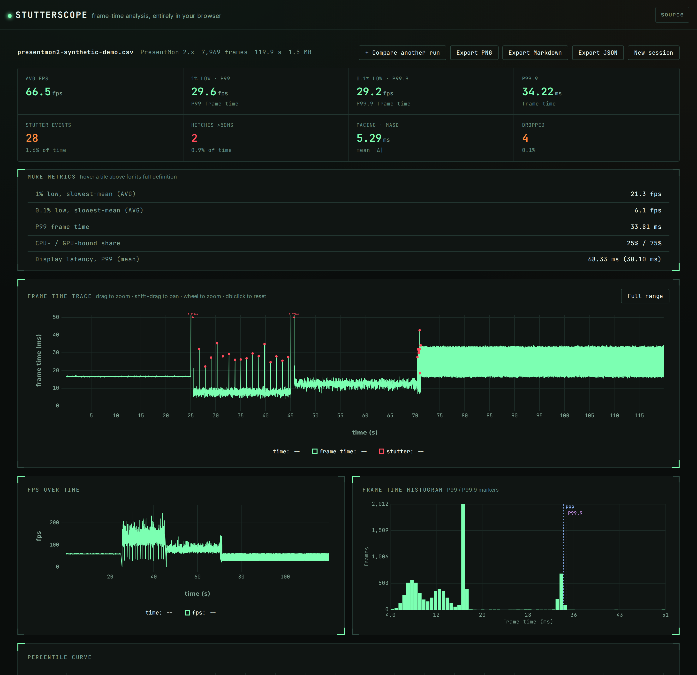
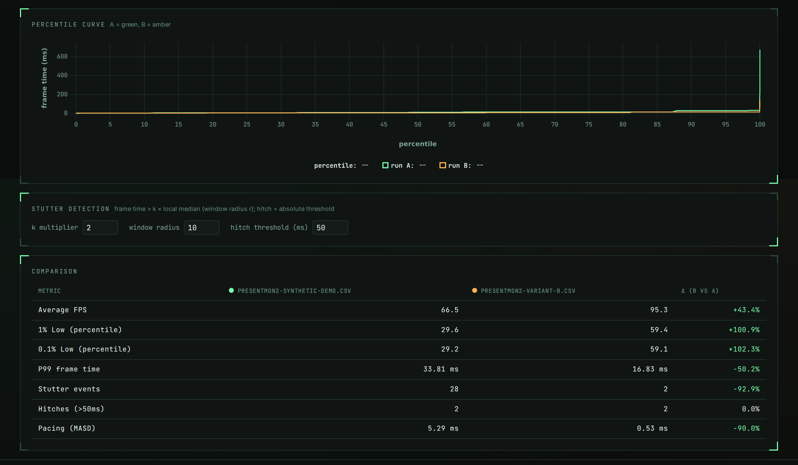

# stutterscope

Frame-time analysis for PC gamers and hardware reviewers. Drop in a capture, see the stutter.

[](LICENSE)
[](https://antonsoo.github.io/stutterscope/)



Two-run comparison, with a metric-by-metric delta table (real output, from
two different synthetic captures — not the same run twice):



## Why this exists

Average FPS is the number every benchmark chart leads with, and it's the
number that hides stutter. A GPU can average 90 fps while dropping to a
choppy 30 for two seconds every time the game streams in a new area — the
average barely moves, but the frame *feels* wrong the whole time. That
information lives in the frame-time trace, not the mean.

Frame-time capture tools (PresentMon, FrameView, CapFrameX, MangoHud, OCAT)
already record the right data. The gap is in the analysis: it's mostly
Windows desktop apps, "1% low" means two different things depending which
tool computed it and nobody tells you which, and there's no fast way to
drop two runs side by side and see what actually changed. stutterscope is a
single-page, in-browser analyzer that reads six real capture formats plus
any CSV, computes stutter/1%-low/pacing metrics with documented formulas,
and never uploads the file anywhere — parsing, metrics, and every chart run
in a Web Worker in your own browser.

## Quickstart

```bash
git clone https://github.com/antonsoo/stutterscope.git
cd stutterscope
npm install && npm run dev
```

Open the printed local URL, click one of the "load a synthetic sample"
links, and you're looking at a real (synthetic, clearly labelled) capture.
Or skip the clone and use the [live demo](https://antonsoo.github.io/stutterscope/) —
same app, same guarantee that nothing you drop on it leaves your browser.

Prefer the terminal? `npx` builds and runs the CLI for you (no manual build
step, no separate install):

```bash
npx github:antonsoo/stutterscope summary examples/samples/presentmon2-synthetic-demo.csv
```

> **npm 12+** disables git-hosted packages by default (`allow-git=none`), so
> the command above fails with `EALLOWGIT` unless you opt in:
> `npx --allow-git=root github:antonsoo/stutterscope summary <file>`.

## Features

- **Parsers** for PresentMon 1.x and 2.x, NVIDIA FrameView, CapFrameX,
  MangoHud, and OCAT CSVs, auto-detected from the file's header — plus a
  generic CSV column-mapping dialog for anything else. Every format is
  verified against upstream source/docs or a real captured sample; see
  [`docs/formats.md`](docs/formats.md).
- **Metrics**, each with a documented formula in
  [`docs/metrics.md`](docs/metrics.md): average FPS computed correctly
  (frames ÷ total time, not a mean of per-frame FPS), frame-time
  percentiles (P50/P90/P95/P99/P99.9), 1% and 0.1% lows under *both*
  common definitions, configurable stutter-event and hitch detection,
  frame-pacing variability (MASD), dropped frames, CPU-/GPU-bound share and
  display latency where the format supports it.
- **Visuals**: a frame-time trace with stutter markers (drag to zoom,
  shift-drag to pan, wheel to zoom, double-click to reset), FPS over time,
  a frame-time histogram, and a percentile curve — plus a second-run
  overlay with a metric-by-metric delta table. The trace defaults to a
  robust y-range (`max(50ms, 1.5 × P99.9)`) so ordinary pacing and moderate
  stutter stay visible instead of being flattened by a rare severe hitch;
  hitches beyond that range are still drawn, clamped to the top with their
  real value labeled, and a "Full range" toggle shows the true scale on
  demand. Dark only, deliberately: the whole visual idea is an oscilloscope
  screen reading a live trace, and a light variant would work against that
  rather than with it.
- **Sharing**: export a PNG report card, a Markdown table (paste into a
  forum post or PR description), or a full JSON summary. Nothing is
  uploaded at any point.
- **Fast on real-sized captures**: parsing streams off the file in a Web
  Worker with a hand-rolled incremental line scanner (no `split()` on a
  430k-line file, no per-row object allocation) — see
  [How it works](#how-it-works).
- **A small Node CLI** (`stutterscope summary <file>`) sharing the exact
  same core library as the browser app. Its source runs directly under Node
  from a git clone, but an installed copy (`npx`/`npm i -g`) lives under
  `node_modules`, where Node's native TypeScript support refuses to run —
  so a `prepare` script compiles it to plain JS automatically on install;
  see [How it works](#how-it-works).

## Usage

Drop a file on the page (or click one of the seven "load a synthetic
sample" links to try it with no file of your own) and you get a tile grid
plus four charts. Load a second run to compare:

```
$ npx github:antonsoo/stutterscope summary examples/samples/presentmon2-synthetic-demo.csv

presentmon2-synthetic-demo.csv  PresentMon 2.x
7,969 frames, 119.9s

  Average FPS            66.5
  1% low (percentile)    29.6 fps
  1% low (slowest-mean)  21.3 fps
  0.1% low (percentile)  29.2 fps
  P99 frame time         33.81 ms
  P99.9 frame time       34.22 ms
  Stutter events         28  (1.55% of capture time)
  Hitches (>50ms)         2
  Pacing (MASD)          5.29 ms
  Dropped frames         4 (0.05%)
  CPU- / GPU-bound       25% / 75%
  Display latency P99    68.33 ms
```

That output is real, from the synthetic PresentMon 2.x sample committed in
`examples/samples/`. All seven sample files (one per format) encode the
*same* underlying scenario — a vsync-locked menu, a shader-compile hitch, a
VRR-style traversal section with periodic streaming stutter, a bigger
hitch, a CPU-bound section, a stutter cluster, and a GPU-bound vsync
sawtooth — so the numbers above should come out identical regardless of
which format you point the CLI or the web app at (they do: it's how this
project's cross-format tests catch a parser silently reading the wrong
column).

## How it works

**Parsing.** Each format has its own `sniff()`/parser pair in
`src/core/parsers/`. Detection reads the first chunk of the file and scores
every format by header fingerprint (`src/core/parsers/index.ts`); the
highest-confidence match wins, and generic CSV is the always-available
fallback. Parsing itself never materializes the file as an array of line
strings: `src/core/stream.ts` reads the `File` in chunks via
`file.stream()`, decodes incrementally, and a small `LineScanner`
(`src/core/csv.ts`) buffers partial lines across chunk boundaries. Each
numeric channel accumulates into a growable typed-array builder
(`src/core/buffer.ts`) that doubles capacity like a `Vec`, so a 430k-row
capture ends up as a handful of `Float64Array`s, not 430k small objects.
Measured on this machine (14 vCPU WSL2 Linux, 48 GB RAM): a synthetic
430,000-row / 66.7 MB PresentMon 2.x CSV parses in **856 ms** and computes
its full metrics summary in another **132 ms** (`tests/core/performance.test.ts`).

**Off the main thread.** `src/worker/parse.worker.ts` owns parsing and
metrics; the UI (`src/ui/`) only ever talks to it through a small
promise-based client (`src/ui/workerClient.ts`) and renders whatever comes
back. Large results come back as structured-cloned typed arrays; only the
worker's own cached copy of a run is kept around so moving the
stutter-threshold sliders can recompute without re-parsing.

**Charts.** The frame-time trace, FPS-over-time, and percentile-curve
charts use [uPlot](https://github.com/leeoniya/uPlot), which renders
directly from typed arrays on a single canvas — the reason this stays
smooth at hundreds of thousands of points without any bundled charting
framework. The histogram is a ~30-line canvas draw. Total JS bundle:
**76 KB (30.6 KB gzipped)** for the app plus a 17 KB worker chunk — see
`npm run build`'s output.

**Metrics.** Every formula is written out in
[`docs/metrics.md`](docs/metrics.md) and mirrored exactly in
`src/core/metrics.ts` — including *why* two tools can report different "1%
lows" for the same capture (they're answering different questions; both
are computed and shown).

**The CLI's two run modes.** `npm run cli` runs `src/cli/index.ts` directly
from source — fine, since Node's native TypeScript support can strip types
from any file outside `node_modules`. An installed copy can't take that
path: `npx`/`npm i -g` place the package under `node_modules`, and Node
explicitly refuses to strip types there
(`ERR_UNSUPPORTED_NODE_MODULES_TYPE_STRIPPING`, verified by installing a
packed tarball and running the symlinked bin against a real capture).
`tsconfig.cli.json` compiles `src/core` and `src/cli` to plain JS in
`dist-cli/` (TypeScript 5.7+'s `rewriteRelativeImportExtensions` rewrites
the `.ts` import specifiers the source needs for the first path into `.js`
as it emits); a `prepare` script runs that build automatically whenever npm
installs the package from git — which is exactly the `npx github:...` path
above — so nothing has to be pre-built or committed.

## Accuracy and limitations

- **Format verification is source/sample-based, not device-tested.**
  Parsers are checked against upstream source code, official docs, or a
  real captured file from each project's own repository (all cited in
  [`docs/formats.md`](docs/formats.md)) — this project doesn't own a
  PresentMon/FrameView/CapFrameX/MangoHud/OCAT license or the hardware to
  generate a fresh capture with each tool. If you hit a real capture that
  doesn't parse, please open an issue with a redacted sample.
- **NVIDIA FrameView's schema isn't officially published** column-by-column
  (it's closed-source); the parser is verified against one real captured
  log redistributed by a third-party viewer, and FrameView's own
  telemetry-column set is known to vary by GPU/driver — see
  `docs/formats.md` for exactly what's read vs. ignored.
- **CapFrameX and OCAT CSVs can be indistinguishable.** When CapFrameX
  exports without its metadata comment block, its CSV is byte-identical in
  schema to OCAT's. Detection picks CapFrameX only when that block is
  present; otherwise it's labelled OCAT. The metrics are the same either
  way, since both share the same underlying present-hook data.
- **Dropped-frame and latency definitions differ across formats** by
  construction (each tool defines them differently); stutterscope doesn't
  normalize them into one made-up cross-tool number, and says which
  column each figure comes from in `docs/formats.md`/`docs/metrics.md`.
- **Everything is held in memory.** There's no out-of-core / paged parsing
  — a capture has to fit in the browser tab's available memory. This is
  comfortable well past the 430k-row/240fps/30-minute case the brief for
  this project called out, but an hours-long capture at very high sample
  rates could exhaust it.
- **The stutter-detection defaults (k = 2.0, window radius = 10 frames,
  hitch = 50 ms) are reasonable starting points, not a standard.** They're
  configurable in the UI and CLI precisely because "what counts as a
  stutter" is a judgment call; see `docs/metrics.md` for the exact
  definitions so you can decide if the defaults fit your use case.
- **Samples are synthetic**, generated deterministically by
  `scripts/generate-samples.ts` and labelled as such everywhere they
  appear (filenames, the in-app sample picker, `examples/samples/manifest.json`).
  They're built to exercise realistic patterns, not to imitate a specific
  game.

## Development

```bash
npm run dev        # local dev server
npm test           # vitest — parsers, metrics, and a numpy-oracle cross-check
npm run typecheck  # tsc --noEmit, strict
npm run lint       # eslint
npm run build      # production build to dist/
npm run samples    # regenerate examples/samples/ from scripts/generate-samples.ts
npm run cli -- summary <file>  # run the CLI from source
npm run build:cli  # compile the CLI to dist-cli/ (also runs automatically on `npm install`)
```

Tests cross-check the metrics library against `numpy` on a committed
synthetic frame-time trace (`scripts/oracle.py` is the oracle;
`tests/core/oracle.test.ts` does the comparison) and check every parser
against a small, hand-computable fixture built from that format's *real*
column headers. See [`CONTRIBUTING.md`](CONTRIBUTING.md) for how to add a
format or a metric.

## Contributing

Issues and PRs welcome — see [`CONTRIBUTING.md`](CONTRIBUTING.md). Please
run `npm run lint && npm run typecheck && npm test` before opening a PR.

## License

[MIT](LICENSE) © 2026 Anton Soloviev

---

<sub>Part of [Officina](https://antonsoo.github.io/officina/), a set of small open-source tools by [Anton Soloviev](https://github.com/antonsoo).</sub>
